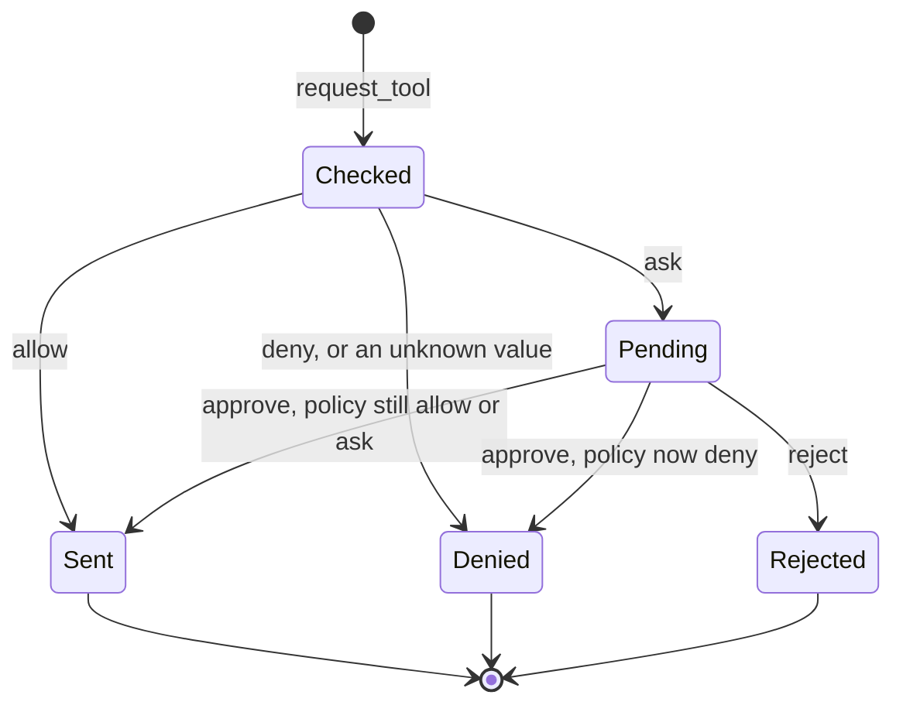

*Part 1 of the [MCP Security]() series.*

## The question

An [MCP server](/glossary/mcp-server/) lists its tools. Something asks to call one. Who decides whether that call happens?

The [MCP client](/glossary/mcp-client/). It is the only party that acts for the user, and the only place a [tool call](/glossary/tool-call/) can be stopped before it leaves the user's side.

## The threat

The server publishes the tools. In an AI application, a model picks which to call and with what arguments, and the model can be steered by anything it reads. A [prompt-injected](/glossary/prompt-injection/) model will happily ask for `delete_file` or `execute_command`. The server won't save you either: you can't see its code, and a malicious one wants the call to happen.

So the decision has to sit in the client, in code that doesn't care who made the request.

## What the spec says

The [tools page](https://modelcontextprotocol.io/specification/2025-06-18/server/tools) of the MCP specification says "there **SHOULD** always be a [human in the loop](/glossary/human-in-the-loop/) with the ability to deny tool invocations". Clients **SHOULD** prompt for confirmation on sensitive operations, show tool inputs to the user before calling the server, and log tool usage.

Every one of those is a SHOULD. The protocol carries the call; it doesn't enforce anything. What happens is up to the client you build.

## The reference implementation

Each tool gets a policy: `allow` sends it, `deny` refuses it, `ask` holds it for a human. The defaults are secure, and a `permissions.json` file layers the user's overrides on top.

```python
DEFAULT_PERMISSIONS = {
    "read_file": "allow",
    "write_file": "ask",
    "delete_file": "deny",
    "execute_command": "deny",
}
```

[Full source](https://github.com/dominicfarr/mcp-secuirty-working-notes-example/blob/03a9398833959d25549665bbd053ddff54430393/client/permissions.py#L8-L13)

A request moves through a small set of states. Only one path reaches the server without a person.



`request_tool` is the single entry point. It copies the arguments first, then checks the policy.

```python
request = ToolRequest(uuid.uuid4().hex[:8], tool_name, copy.deepcopy(arguments or {}))
permission = self.check_permission(tool_name, request.arguments)

if permission not in POLICIES:
    # Fail closed: a typo such as "Deny" must never be treated as allow
    reason = f"policy: invalid value {permission!r}"
    self.log_audit(request, "DENIED", reason)
    return ToolOutcome(request, "DENIED", reason)
# …
if permission == "ask":
    self.pending[request.request_id] = request
    self.log_audit(request, "ASK", REASON_AWAITING)
    # Return a copy: the stored request must not be changeable through the outcome
    return ToolOutcome(copy.deepcopy(request), "ASK", REASON_AWAITING)
```

[Full source](https://github.com/dominicfarr/mcp-secuirty-working-notes-example/blob/03a9398833959d25549665bbd053ddff54430393/client/client.py#L307-L328)

Approval sends the stored request, not whatever is on screen when the user clicks.

```python
async def approve(self, request_id: str) -> ToolOutcome:
    """Send a pending request exactly as it was made, once. KeyError if not pending."""
    request = self.pending.pop(request_id)
    if self.check_permission(request.tool_name, request.arguments) not in ("allow", "ask"):
        self.log_audit(request, "DENIED", REASON_POLICY_CHANGED)
        return ToolOutcome(request, "DENIED", REASON_POLICY_CHANGED)
    return await self._send(request, REASON_USER_APPROVED)
```

[Full source](https://github.com/dominicfarr/mcp-secuirty-working-notes-example/blob/03a9398833959d25549665bbd053ddff54430393/client/client.py#L330-L336)

## Gotchas

**An approval is only as good as what it binds to.** The obvious version approves "the request in the form". Edit the form after clicking request, then approve, and a different call goes out than the one the user read. So the client deep-copies the arguments when the request is made, stores it in a frozen dataclass, and hands the caller a separate copy. The copies do the real work: `frozen` stops fields being reassigned, but the `arguments` dict inside is still mutable. Nothing outside the client can change what gets sent.

**Single use.** `approve` pops the request. A second click, or a replayed request ID, raises `KeyError` and sends nothing.

**Check again at approval time.** A request can sit pending while the user flips the tool to `deny` on another tab. Approving it then must not send it. The policy is checked when the request is made and again when it's approved.

**[Fail closed](/glossary/fail-closed/) on bad config.** `"Deny"` with a capital D is not a policy. Treat an unknown value as `deny`, never as "not deny".

**Unknown tools ask.** A tool with no policy, such as one the server added since you last looked, falls through to `ask`, not `allow`.

**The server's description is not the policy.** The app shows the server's tool description next to the client's policy, in separate columns. A server can write "safe, read-only" in a description. That changes nothing about what the client does: `check_permission` reads only the client's own policy. The spec is firm on the structured version of this: clients **MUST** "consider tool annotations to be untrusted unless they come from trusted servers".

**Log every decision.** A denied request never reaches the server, so the server's log can't record it. The client keeps its own [audit log](/glossary/audit-log/) of every decision.

## Proof

Each guarantee is a test, named for what it proves:

- [`test_permissions.py`](https://github.com/dominicfarr/mcp-secuirty-working-notes-example/blob/03a9398833959d25549665bbd053ddff54430393/tests/test_permissions.py): `test_deny_never_reaches_the_server`, `test_ask_holds_the_call_until_approved`, `test_unknown_policy_value_fails_closed`, `test_policy_change_before_approval_is_enforced`
- [`test_approval.py`](https://github.com/dominicfarr/mcp-secuirty-working-notes-example/blob/03a9398833959d25549665bbd053ddff54430393/tests/test_approval.py): `test_approval_sends_the_stored_request_not_the_form`, `test_approval_is_single_use`, `test_returned_outcome_cannot_redirect_the_approval`, `test_reject_sends_nothing`

The client decides whether the call is sent. Once it is, the client has no say in what the server does. That's the next part.

---

[MCP Security (series hub)]() · Next: [Roots are a request, not a wall]()
