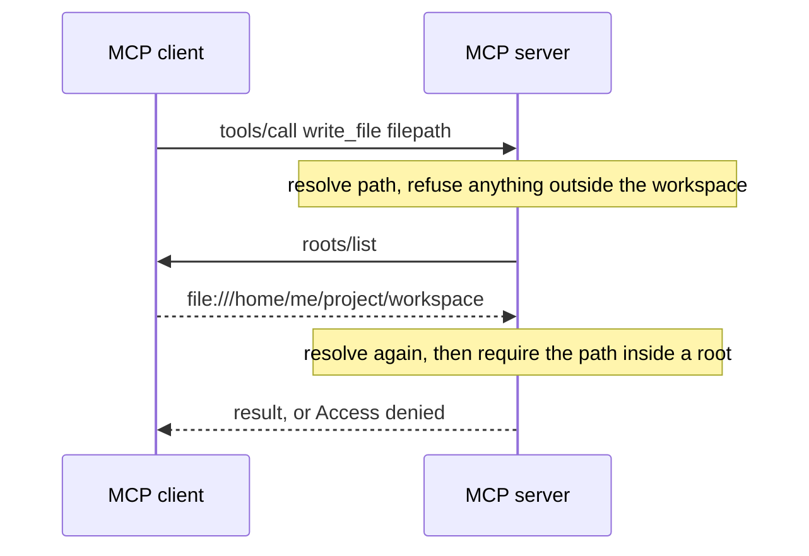
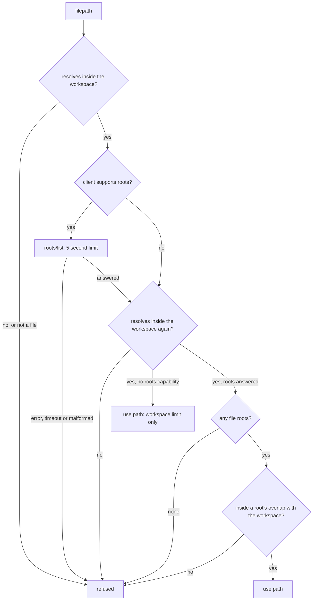

*Part 2 of the [MCP Security]() series.*

## The question

The client has decided to send `write_file("notes/todo.txt")`. Can it also say *where* the server is allowed to write?

It can ask. MCP [roots](/glossary/roots/) let the client declare the folders a server should work in. Whether that request is honoured is entirely up to the server.

## The threat

A local server started over the [stdio transport](/glossary/stdio-transport/) runs on your machine with your permissions. Nothing stops `read_file("../../.ssh/id_rsa")` except the server's own code. If a [prompt-injected](/glossary/prompt-injection/) model asks for that path, the client may have allowed `read_file` in general. The policy from [Part 1]() says which tool, not which file.

## What the spec says

The [roots page](https://modelcontextprotocol.io/specification/2025-06-18/client/roots) splits the work. Clients **MUST** "validate all root URIs to prevent [path traversal](/glossary/path-traversal/)". Servers **SHOULD** "respect root boundaries during operations" and "validate all paths against provided roots".

Read that carefully. The client declares. The server SHOULD enforce. A malicious server ignores roots and nothing in the protocol can tell. Roots protect you from an honest server being pointed at the wrong file, not from a dishonest one. For that you need to not run untrusted servers, plus OS permissions and sandboxing.

## The reference implementation

Roots go the opposite way to the call. The [tool call](/glossary/tool-call/) doesn't carry them. The server asks for them while it handles the call.



The server has its own limit first: a `workspace/` folder. Every path is resolved, following `..` and symlinks, then checked against it. Roots can only narrow that limit, never widen it.

```python
def allowed_areas(root_paths: list[Path]) -> list[Path]:
    """Overlap of each client root with the workspace. Roots only narrow the server's own limit:
    a root inside the workspace narrows it, a root containing it gives exactly the workspace,
    and any other root gives nothing."""
    base = WORKSPACE_DIR.resolve()
    areas = []
    for root in root_paths:
        root = root.resolve()
        if root.is_relative_to(base):
            areas.append(root)
        elif base.is_relative_to(root):
            areas.append(base)
    return areas
```

[Full source](https://github.com/dominicfarr/mcp-secuirty-working-notes-example/blob/03a9398833959d25549665bbd053ddff54430393/server/server.py#L96-L108)

Every file tool goes through one function. Every branch but two ends in a refusal.



```python
async def resolve_in_roots(filepath: str, ctx: Context) -> Path:
    # …
    resolve_in_workspace(filepath)  # report path problems before asking the client
    roots = await client_roots(ctx)
    # Resolve again after the await: the filesystem may have changed while the client answered
    # (it controls how long that takes), and the path that was checked must be the path used.
    file_path = resolve_in_workspace(filepath)
    if roots is None:
        return file_path
    if not roots:
        raise ToolError("Access denied: the client declared no roots")
    if not any(file_path.is_relative_to(area) for area in allowed_areas(roots)):
        raise ToolError(f"Access denied: {filepath} is outside the client's roots")
    return file_path
```

[Full source](https://github.com/dominicfarr/mcp-secuirty-working-notes-example/blob/03a9398833959d25549665bbd053ddff54430393/server/server.py#L135-L151)

## Gotchas

**Wide roots grant nothing extra.** Declare `/` and the server gets exactly its workspace. A root somewhere else entirely gives it nothing.

**Check after every await.** The server asks the client for roots mid-call, and the client controls how long that takes. In that gap a folder can be swapped for a symlink to somewhere outside. The path is resolved before the question and again after it, and the second result is the one used. That's a [TOCTOU](/glossary/toctou/) window shrunk from however long the client takes to a few microseconds of synchronous code. Shrunk, not closed: [Part 4]() comes back to what closing it would take.

**Missing and empty are different.** A client that never declared the roots capability gets the workspace limit alone, as the spec asks servers to check the capability first. A client that declares the capability and then sends an empty list has declared nothing, so every path is refused.

**[Fail closed](/glossary/fail-closed/) on the answer.** No reply within 5 seconds, a protocol error, or a malformed list all refuse the call. Only `file://` URIs naming the local host count; anything else is dropped.

**Errors don't leak paths.** "Access denied: notes.txt is outside the client's roots" names what the caller sent, not where the server's workspace lives. That holds for every refusal the server raises on purpose. An unexpected exception is another matter: FastMCP passes its text through unless the server is created with `mask_error_details=True`, and an `OSError` message can carry a full path. Turn masking on in anything real.

**A root narrows; it doesn't move the starting point.** Paths are always relative to the workspace. With the root `workspace/projects/`, `projects/a.txt` is allowed and `a.txt` is refused, because `a.txt` means `workspace/a.txt`, outside the root. That's easy to trip over, so the app pre-fills the root's prefix when you pick a tool.

**Remote servers.** A server over HTTP runs on its own machine. A `file://` root naming a folder on yours means nothing there. File roots are mostly for local servers.

## Proof

- [`test_roots.py`](https://github.com/dominicfarr/mcp-secuirty-working-notes-example/blob/03a9398833959d25549665bbd053ddff54430393/tests/test_roots.py): `test_root_inside_workspace_narrows_access`, `test_wide_root_gives_only_the_workspace`, `test_root_outside_workspace_refuses_everything`, `test_empty_roots_refuse_everything`, `test_client_without_roots_support_gets_the_workspace`, `test_only_local_file_uris_count`, `test_slow_roots_answer_is_refused`, `test_server_asks_for_roots_during_the_call`
- [`test_workspace.py`](https://github.com/dominicfarr/mcp-secuirty-working-notes-example/blob/03a9398833959d25549665bbd053ddff54430393/tests/test_workspace.py): `test_path_traversal_is_refused`, `test_errors_never_reveal_server_paths`, `test_symlink_swapped_during_a_call_is_not_followed`

The symlink test does what an attacker would: its roots callback swaps the folder for a link, then answers. The write must fail and nothing may appear outside.

---

Previous: [Allow, ask, deny]() · [Series hub]() · Next: [Ask the human, not the caller]()
