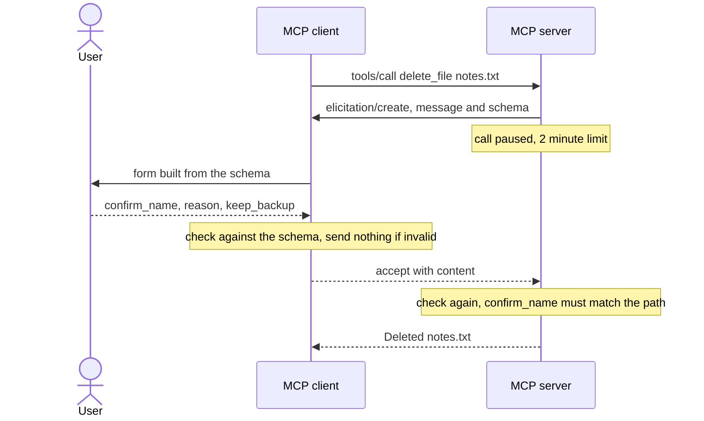

*Part 3 of the [MCP Security]() series.*

## The question

Some decisions can only be made by the server, and only once it's partway through the call. `delete_file` doesn't know how big the file is, or when it was last changed, until it looks. How does it ask the user to confirm?

[Elicitation](/glossary/elicitation/). The server pauses the [tool call](/glossary/tool-call/) and asks the user, through the client, for structured input.

## The threat

The obvious alternative is a tool argument: `delete_file(filepath, confirm=true)`. But arguments are filled in by whoever makes the call. In an AI application that's the model, and a [prompt-injected](/glossary/prompt-injection/) model will set `confirm=true` every time. A confirmation the caller can supply confirms nothing.

Elicitation goes around the caller. The question travels from the server to the client to a person, so the model can't answer it, as long as the client shows it to a person and never hands it to the model. Nothing in the protocol enforces that. A host that lets its LLM fill in elicitation forms has thrown the whole benefit away.

## What the spec says

The [elicitation page](https://modelcontextprotocol.io/specification/2025-06-18/client/elicitation) is short and its security list is direct:

- Servers **MUST NOT** request sensitive information through elicitation.
- Both parties **SHOULD** validate elicitation content against the provided schema.
- Clients **SHOULD** allow users to decline elicitation requests at any time.

The schema is deliberately limited to a flat object of strings, numbers, integers and booleans. The answer is one of three actions: `accept` with content, `decline`, or `cancel`.

## The reference implementation



The server describes what it needs as a Pydantic model. FastMCP sends it as the JSON schema.

```python
class DeleteConfirmation(BaseModel):
    """What the server asks the user before deleting a file; sent as the elicitation schema."""
    confirm_name: str = Field(description="Type the file path to confirm")
    reason: str = Field(min_length=5, max_length=200,
                        description="Why it's being deleted (recorded in the server audit log)")
    keep_backup: bool = Field(default=False,
                              description="Keep a .bak copy instead of deleting outright")
```

[Full source](https://github.com/dominicfarr/mcp-secuirty-working-notes-example/blob/03a9398833959d25549665bbd053ddff54430393/server/server.py#L154-L160)

Every outcome other than a valid, matching accept is an error, and nothing is deleted.

```python
try:
    with anyio.fail_after(ELICITATION_TIMEOUT_SECONDS):
        answer = await ctx.elicit(message, response_type=DeleteConfirmation)
except TimeoutError as e:
    waited = duration_text(ELICITATION_TIMEOUT_SECONDS)
    raise ToolError(f"Deletion cancelled (no answer within {waited})") from e
except ValidationError as e:
    # The server checks the answer again: it can't trust the client's validation
    first = e.errors()[0]
    field = ".".join(str(part) for part in first["loc"])
    raise ToolError(f"Confirmation was not valid: {field}: {first['msg']}") from e
if isinstance(answer, DeclinedElicitation):
    raise ToolError("Deletion declined by the user")
if isinstance(answer, CancelledElicitation):
    raise ToolError("Deletion cancelled")
confirmation = answer.data
if confirmation.confirm_name != filepath:  # a rule a schema can't express
    raise ToolError(f"Confirmation did not match: you typed '{confirmation.confirm_name}', "
                    f"expected '{filepath}'")
return confirmation
```

[Full source](https://github.com/dominicfarr/mcp-secuirty-working-notes-example/blob/03a9398833959d25549665bbd053ddff54430393/server/server.py#L203-L222)

On the client side, the answer is checked against the server's schema before it goes anywhere:

```python
if action == "accept":
    errors = schema_errors(question.schema, content or {})
    if errors:
        raise InputInvalid(errors)
```

[Full source](https://github.com/dominicfarr/mcp-secuirty-working-notes-example/blob/03a9398833959d25549665bbd053ddff54430393/client/client.py#L426-L429)

## Gotchas

**You want both layers of consent.** The client's policy from [Part 1]() decides whether `delete_file` is sent at all. The server's question confirms details only the server knows: "Confirm deletion of notes.txt (2.3 KB, modified 2026-10-05 14:30)". They answer different questions, so you want both.

**Validate on both sides.** The client checks so the user gets a useful error and nothing malformed is sent. The server checks again because it can't trust the client. And some rules don't fit in a schema at all: "type the file path" must equal *this* path, which only the server can check.

**[Fail closed](/glossary/fail-closed/) everywhere.** A client without the elicitation capability can't delete. No answer in 2 minutes is a cancel. Decline and cancel both delete nothing.

**The call has to be able to pause.** A tool call is one request and one response, and elicitation arrives in the middle. So the client runs each call in a background task. When a question arrives, it returns to the UI with the call still open and the question attached. Answering resumes the same call. A client written as plain request-and-wait has to be restructured for this, so plan for it early.

**Abandoned forms hold the connection.** While a question is open, the MCP Python library reads nothing else from that server. Close the browser tab mid-question and the client is stuck. So the client gives up a few seconds after the server would, records it as cancelled, and carries on.

**Forms the client can't draw.** A nested schema can't be shown faithfully as a simple form. The client declines it automatically and audits that it did, rather than showing half a form.

**No shortcut.** An early version of the client had a `request_elicitation` helper that answered on the user's behalf. It's gone, and a test checks it doesn't come back. That test only rules out one name; the real guard is that the only path to an answer is `answer_input`, called from the UI.

**Don't ask for secrets.** The one MUST in the spec's security list. A confirmation is fine. A password is not.

## Proof

- [`test_elicitation.py`](https://github.com/dominicfarr/mcp-secuirty-working-notes-example/blob/03a9398833959d25549665bbd053ddff54430393/tests/test_elicitation.py): `test_delete_asks_with_details_only_the_server_knows`, `test_client_validates_against_the_schema_before_sending`, `test_server_validates_again`, `test_confirmation_must_match_the_file`, `test_decline_and_cancel_delete_nothing`, `test_client_without_elicitation_cannot_delete`, `test_unanswered_question_does_not_block_the_client`, `test_late_answer_deletes_nothing`, `test_unsupported_form_is_declined_and_audited`, `test_no_auto_approving_shortcut`

Confirmation was the last check. It isn't the last thing that can go wrong: the user took a minute to answer, and the file may have changed. That's the next part.

---

Previous: [Roots are a request, not a wall]() · [Series hub]() · Next: [One delete, every check]()
