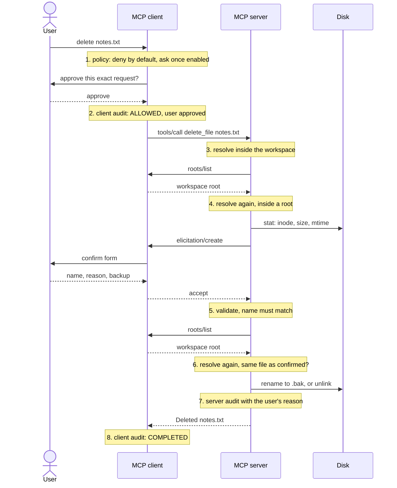

*Part 4 of the [MCP Security]() series.*

## The question

The last three parts each covered one control. What does it look like when they all apply to one call?

`delete_file("notes.txt")` is the most dangerous tool in the demo that actually does something, so it gets every layer. This post follows one call from click to disk. The steps are numbered in the diagram; each one is either covered in an earlier part or explained in the gotchas below.

## The threat

No single check is enough on its own. Policy can be misconfigured. A user can approve without reading. A path can be valid when checked and point somewhere else a minute later. A confirmed file can be swapped before it's removed. Defence in depth means each layer assumes the others have already failed.

## What the spec says

The [tools page](https://modelcontextprotocol.io/specification/2025-06-18/server/tools) puts duties on both sides. Servers **MUST** "validate all tool inputs" and "implement proper access controls". Clients **SHOULD** prompt for confirmation on sensitive operations and "log tool usage for audit purposes". The [roots](https://modelcontextprotocol.io/specification/2025-06-18/client/roots) and [elicitation](https://modelcontextprotocol.io/specification/2025-06-18/client/elicitation) pages add their own, covered in Parts 2 and 3. None of them says how to combine them. That's the implementation's job.

## The reference implementation



The tool itself is short because each step is a function covered earlier:

```python
file_path = await resolve_in_roots(filepath, ctx)
if not file_path.exists():
    raise ToolError(f"File {filepath} not found")
asked_about = file_identity(file_path)
confirmation = await confirm_deletion(filepath, file_path, ctx)
backup_note = "yes" if confirmation.keep_backup else "no"
AUDIT_NOTE.set(f"answer: accept; reason: {confirmation.reason}; backup: {backup_note}")
file_path = await resolve_in_roots(filepath, ctx)  # again: the user may have taken minutes
try:
    if file_identity(file_path) != asked_about:  # delete only the file the user confirmed
        raise ToolError(f"File {filepath} changed while waiting for confirmation; not deleted")
    if confirmation.keep_backup:
        backup = backup_path(file_path)
        file_path.rename(backup)
        kept = backup.relative_to(WORKSPACE_DIR.resolve()).as_posix()
        return f"Deleted {filepath} (backup kept as {kept})"
    file_path.unlink()
    return f"Deleted {filepath}"
```

[Full source](https://github.com/dominicfarr/mcp-secuirty-working-notes-example/blob/03a9398833959d25549665bbd053ddff54430393/server/server.py#L272-L289)

What the user confirmed is a file, not a name. Identity is the inode, size and modification time. (An inode number is only unique within one device; adding `st_dev` would make it airtight across mounts.)

```python
def file_identity(file_path: Path) -> tuple[int, int, int]:
    """What identifies the file the user was asked about: inode, size and modification time."""
    stat = file_path.stat()
    return stat.st_ino, stat.st_size, stat.st_mtime_ns
```

[Full source](https://github.com/dominicfarr/mcp-secuirty-working-notes-example/blob/03a9398833959d25549665bbd053ddff54430393/server/server.py#L177-L180)

Each side writes its own [audit log](/glossary/audit-log/) in the same JSON-lines shape. For this call they look like this (illustrative, trimmed):

```json
{"actor": "client", "tool": "delete_file", "args": {"filepath": "notes.txt"}, "outcome": "ASK", "detail": "awaiting approval", "request_id": "3f9c1a2b"}
{"actor": "client", "tool": "delete_file", "args": {"filepath": "notes.txt"}, "outcome": "ALLOWED", "detail": "user approved", "request_id": "3f9c1a2b"}
{"actor": "client", "tool": "delete_file", "args": {"confirm_name": "notes.txt", "reason": "old draft", "keep_backup": true}, "outcome": "INPUT ACCEPTED", "request_id": "3f9c1a2b"}
{"actor": "client", "tool": "delete_file", "args": {"filepath": "notes.txt"}, "outcome": "COMPLETED", "request_id": "3f9c1a2b"}
{"actor": "server", "tool": "delete_file", "args": {"filepath": "notes.txt"}, "outcome": "success", "detail": "answer: accept; reason: old draft; backup: yes"}
```

## Gotchas

**The wait is the attack window.** The user might take a minute to answer. In that minute, someone can replace `notes.txt` with a different file, or swap a folder for a symlink. So after the answer, the server resolves the path again (roots included) and compares the file's identity with the one it described. Different file, no delete. This is the [TOCTOU](/glossary/toctou/) gap from Part 2, only longer.

**Order matters.** Path problems are reported before the client is asked for roots, and a missing file is reported before the user is asked anything. Nobody should confirm a delete that was always going to fail. The user's reason is attached to the audit record before the second check, so if the call is refused after confirmation, the server's log still records the user's answer and reason.

**Narrowed, not closed.** There is still a gap of microseconds between the identity check and the `unlink`. Closing it fully needs OS-level primitives, such as working through a held directory handle. For a reference demo I've kept the code readable and named the gap here instead.

**A backup that overwrites is a delete.** `keep_backup` renames to `notes.txt.bak`. If that already exists, the new backup gets a timestamped name. The old backup is never replaced.

**Logs live outside the workspace.** The file tools can only touch `workspace/`. The server's audit log sits elsewhere, so no [tool call](/glossary/tool-call/) can read, rewrite or delete the record of itself.

**Keep payloads out of the log.** Strings over 100 characters are logged as their length, so large file contents stay out of the audit trail. Short ones are logged as they are; if any argument could hold a secret, summarise it whatever its length.

**One request ID ties the client's records together.** The server's record has no request ID; it is matched to the client's by tool, arguments and time. A real client can't read the server's log at all. The demo shows both only because they share a disk.

## Proof

- [`test_elicitation.py`](https://github.com/dominicfarr/mcp-secuirty-working-notes-example/blob/03a9398833959d25549665bbd053ddff54430393/tests/test_elicitation.py): `test_approval_then_question_works_end_to_end`, `test_file_changed_while_deciding_is_not_deleted`, `test_backup_never_overwrites`
- [`test_audit.py`](https://github.com/dominicfarr/mcp-secuirty-working-notes-example/blob/03a9398833959d25549665bbd053ddff54430393/tests/test_audit.py): `test_each_side_logs_in_its_own_folder`, `test_client_entries_share_the_request_id`, `test_server_logs_every_call_including_refusals`, `test_long_arguments_are_summarised_not_logged`
- [`test_roots.py`](https://github.com/dominicfarr/mcp-secuirty-working-notes-example/blob/03a9398833959d25549665bbd053ddff54430393/tests/test_roots.py): `test_roots_are_checked_when_the_call_is_sent`

Eight steps for one delete. The last part is about how I know they all still hold.

---

Previous: [Ask the human, not the caller]() · [Series hub]() · Next: [Proving it]()
