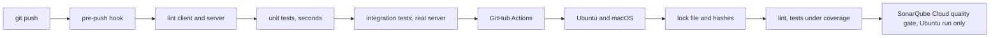

*Part 5 of the [MCP Security]() series.*

## The question

Four posts of controls. How do I know they hold today, and that they'll still hold after the next change?

A security control without a test is a claim. In a reference repo it's worse: a claim other people copy.

## The threat

Security code rots quietly. A refactor moves the second `resolve_in_workspace` call above the `await` and everything still works, so nobody notices. A dependency bump changes how a library handles a timeout. The happy path keeps passing while a guarantee disappears.

The next part of the repo puts an LLM in the loop, which means a lot of change to the client. I wanted the Part 1 guarantees pinned down before that started.

## What the spec says

Nothing. The MCP specification describes behaviour, not how to test it. The [tools page](https://modelcontextprotocol.io/specification/2025-06-18/server/tools) lists what servers MUST do and clients SHOULD do, and leaves proving it to you.

## The reference implementation

**Tests named as guarantees.** The suite is grouped by control, one file each, and every test is named for the promise it proves. Read the names and you have the security spec:

```
test_deny_never_reaches_the_server
test_approval_sends_the_stored_request_not_the_form
test_wide_root_gives_only_the_workspace
test_symlink_swapped_during_a_call_is_not_followed
test_file_changed_while_deciding_is_not_deleted
test_client_without_elicitation_cannot_delete
```

Some tests play the attacker. This one edits the form after the request is made, as a confused user or a hostile page might:

```python
async def test_approval_sends_the_stored_request_not_the_form(make_client):
    client, session = make_client({"write_file": "ask"})
    arguments = {"filepath": "a.txt", "content": "hi"}
    outcome = await client.request_tool("write_file", arguments)
    arguments["filepath"] = "EVIL.txt"  # the form is edited after requesting
    await client.approve(outcome.request.request_id)
    assert session.calls == [("write_file", {"filepath": "a.txt", "content": "hi"})]
```

[Full source](https://github.com/dominicfarr/mcp-secuirty-working-notes-example/blob/03a9398833959d25549665bbd053ddff54430393/tests/test_approval.py#L7-L13)

**Never touch the real thing.** The client and server find their folders from their own file locations. So the suite copies both into a temporary project and imports from the copy. Every path points there with no patching, and your `workspace/`, logs and `permissions.json` are never written.

```python
# The code under test; a sabotage run points this at a deliberately broken copy
SOURCE = Path(os.environ.get("MCP_TEST_SOURCE", REPO)).resolve()
# …
PROJECT = Path(tempfile.mkdtemp(prefix="mcp-part1-tests-")).resolve()
for _side in ("client", "server"):
    shutil.copytree(SOURCE / _side, PROJECT / _side,
                    ignore=shutil.ignore_patterns("__pycache__", "*.log", "logs",
                                                  "permissions.json"))
```

[Full source](https://github.com/dominicfarr/mcp-secuirty-working-notes-example/blob/03a9398833959d25549665bbd053ddff54430393/tests/helpers.py#L23-L33)

**Prove the test can fail.** A test written after the code exists may pass for the wrong reason. `MCP_TEST_SOURCE` points the whole suite at a copy of the code with one control removed, for example the second resolve or the identity check. The matching test has to go red. If it doesn't, it isn't testing what its name says.

**Run it before it leaves the machine.** `main` takes direct pushes, so the checks run in two places:



The hook runs cheapest first and stops at the first failure. CI is the backstop for what the hook can't catch: macOS-only failures, or someone pushing with `--no-verify`. CI installs from a lock file with every package hash-checked and installed only from wheels, so no package's setup script runs on the runner.

## Gotchas

**Fakes for logic, real servers for guarantees.** Unit tests use a fake session and run in seconds. Anything that depends on the protocol (roots asked mid-call, elicitation timing, a symlink swapped during a callback) runs against a real server as a child process. They're slower, and they're the ones that matter.

**Time-based tests need short timeouts.** The demo waits 2 minutes for a confirmation. The suite sets it to 3 seconds through an environment variable so the timeout tests finish quickly. The production value is untouched.

**A scanner's blocker can be a false positive. Prove it.** SonarQube Cloud flagged `write_file` as a [path traversal](/glossary/path-traversal/) blocker (rule S2083): user input reaches `write_text`. Its taint analysis didn't recognise the check inside `resolve_in_workspace` as a sanitiser. I marked it a false positive, but only because `test_path_traversal_is_refused` and the symlink test already show the path can't escape. If you can't point to the test, don't mark it.

**Pin your CI actions.** Sonar also flagged actions referenced by tag. A moved tag changes what runs. They're pinned to commit SHAs now. The same idea, for a different reason, is why every code link in this series points at one commit: a SHA never moves, so the line numbers stay right. The Mermaid script on these pages is pinned to an exact version for the same reason.

## Proof

The proof here is the suite itself: [`tests/`](https://github.com/dominicfarr/mcp-secuirty-working-notes-example/tree/03a9398833959d25549665bbd053ddff54430393/tests), plus [`test_suite_isolation.py`](https://github.com/dominicfarr/mcp-secuirty-working-notes-example/blob/03a9398833959d25549665bbd053ddff54430393/tests/test_suite_isolation.py) (`test_suite_runs_in_a_temporary_copy`, `test_each_test_starts_with_a_clean_project`), the [pre-push hook](https://github.com/dominicfarr/mcp-secuirty-working-notes-example/blob/03a9398833959d25549665bbd053ddff54430393/.githooks/pre-push) and the [CI workflow](https://github.com/dominicfarr/mcp-secuirty-working-notes-example/blob/03a9398833959d25549665bbd053ddff54430393/.github/workflows/tests.yml).

That's Part 1: everything that holds without a model in the loop. Next, the model goes in, and the threats become about what it reads.

---

Previous: [One delete, every check]() · [Series hub]()
